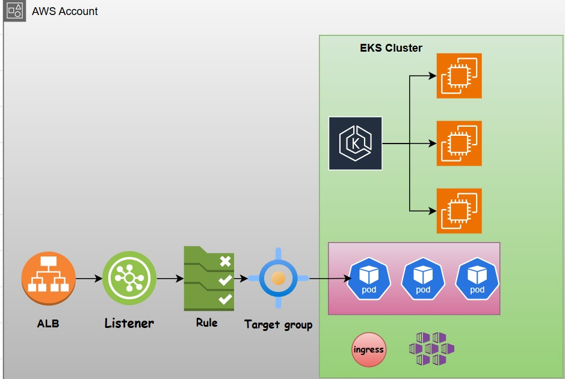

# k8-ingress

Traffic flow
==


- Client -> DNS -> ALB -> Listener -> Rules -> Target groups -> POD IP (target-type IP)
- Client -> DNS -> NLB -> Listener -> Rules -> Target groups (Host IP and host/node port) -> Kube-proxy -> pod/port
  - When target type is "instance"

How?
==
- ALB controller watches for ingress events via kube API. When it finds ingress that satisfies its requirement \
- It starts creating the ALB, listener for each port(default 443/80), Rules, Target group (instance or IP)
- When target type is instance, Host IP and nodeport are registered.
- When target type is IP, pod IP is registered. Traffic reaches directly to pod without nodeport and kube-proxy
- It is possible when ALB and EKS in same VPC and VPC CNI plugin is installed, pod IPs are added as secondary
  IPs in ENI, both exists in same subnect.


Configuration
==
- Create OIDC (Open id Connect) provider in AWS  (For authentication without AWS access key and secret key)
- It validates the service account JWT and issues short lived token for kube resources access AWS resources.
- Create service account and role in EKS.
- Create policy in AWS
- Attach it to role in EKS
- Install AWS LB ingress controller drivers using helm and assing the service account.
- Create ingress resource with annotations to call AWS APIs and service and a deployment to test.

Controller accessing AWS APIs?
==
- It happens through annotations in ingress resource.
- Important annotations => https://kubernetes-sigs.github.io/aws-load-balancer-controller/latest/guide/ingress/annotations/
  - kubernetes.io/ingress.class: alb  (ALB ingress controller will handle/manage the ingress resource)
  - spec:
     ingressClassName: alb
  - alb.ingress.kubernetes.io/scheme: internet-facing  (Default is internal)
  - alb.ingress.kubernetes.io/target-type: ip        (targets pods (recommended))
  - alb.ingress.kubernetes.io/target-type: instance  (targets EC2 nodes)
  - alb.ingress.kubernetes.io/listen-ports: '[{"HTTP":80}]'  (creates listener)
  - alb.ingress.kubernetes.io/listen-ports: '[{"HTTPS":443}]'

  
Installation
==
`1. Install OIDC provider
```
https://kubernetes-sigs.github.io/aws-load-balancer-controller/latest/deploy/installation/

eksctl utils associate-iam-oidc-provider \
    --region us-east-1 \
    --cluster roboshop-dev \
    --approve

aws eks update-kubeconfig --region us-east-1 --name roboshop-dev
```
2. Download & Create IAM policy
```
curl -o iam-policy.json \
https://raw.githubusercontent.com/kubernetes-sigs/aws-load-balancer-controller/v2.16.0/docs/install/iam_policy.json

aws iam create-policy \
    --policy-name AWSLoadBalancerControllerIAMPolicy \
    --policy-document file://iam-policy.json
```
3. Create an IAM role and Kubernetes ServiceAccount for the LBC. Use the ARN from the previous step.
```
eksctl create iamserviceaccount \
--cluster=roboshop-dev \
--namespace=kube-system \
--name=aws-load-balancer-controller \
--attach-policy-arn=arn:aws:iam::406682759639:policy/AWSLoadBalancerControllerIAMPolicy \
--override-existing-serviceaccounts \
--region us-east-1 \
--approve
```
4. Install drivers

Install helm
```
curl -fsSL -o get_helm.sh https://raw.githubusercontent.com/helm/helm/main/scripts/get-helm-4
chmod 700 get_helm.sh
./get_helm.sh
```
Add eks-charts repo
```
helm repo add eks https://aws.github.io/eks-charts
```
Install loadbalancer contoller
```
helm install aws-load-balancer-controller eks/aws-load-balancer-controller -n kube-system --set clusterName=roboshop-dev
--set serviceAccount.create=false --set serviceAccount.name=aws-load-balancer-controller
```

Check drivers are running
```
k get po -n kube-system|grep aws
aws-load-balancer-controller-5449867884-nhsx8   1/1     Running   0          2m18s
aws-load-balancer-controller-5449867884-p9cwq   1/1     Running   0          2m18s
```

